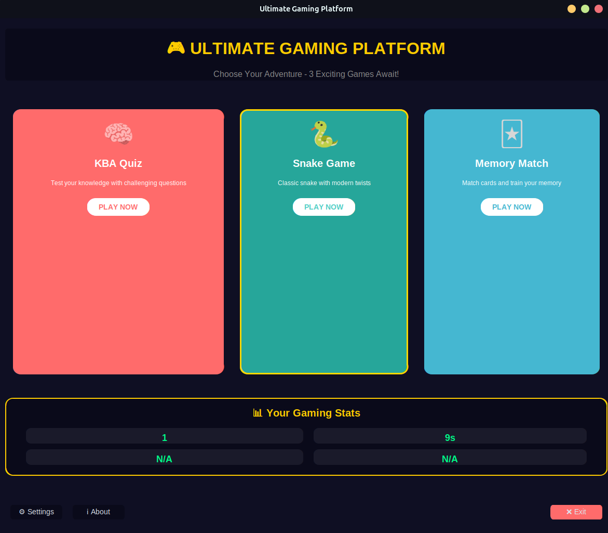
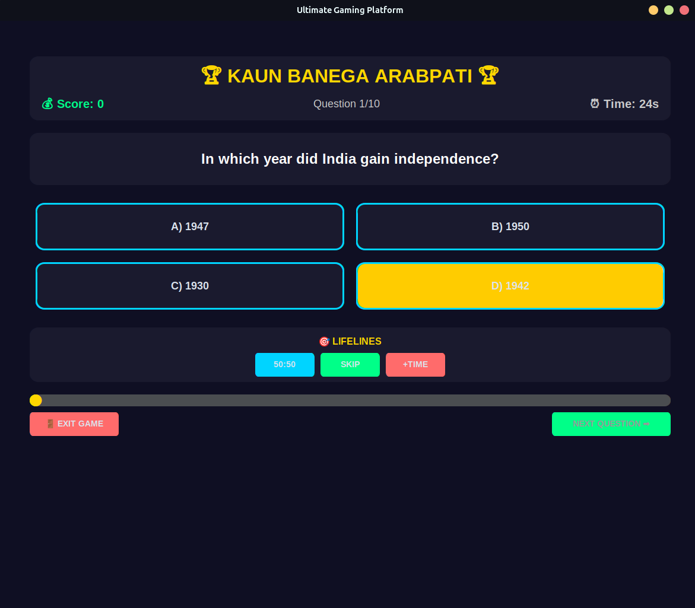
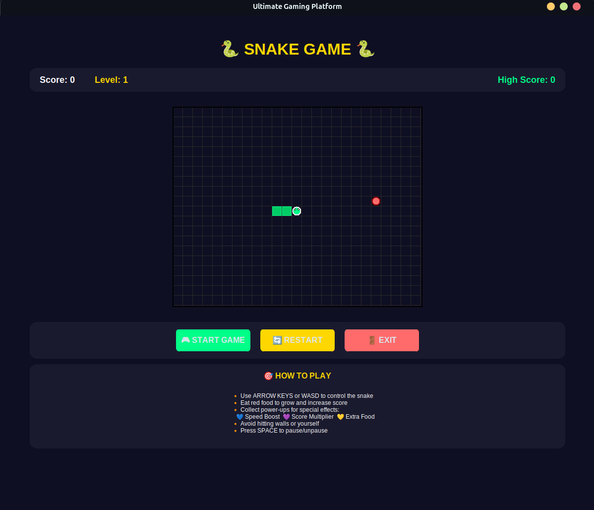
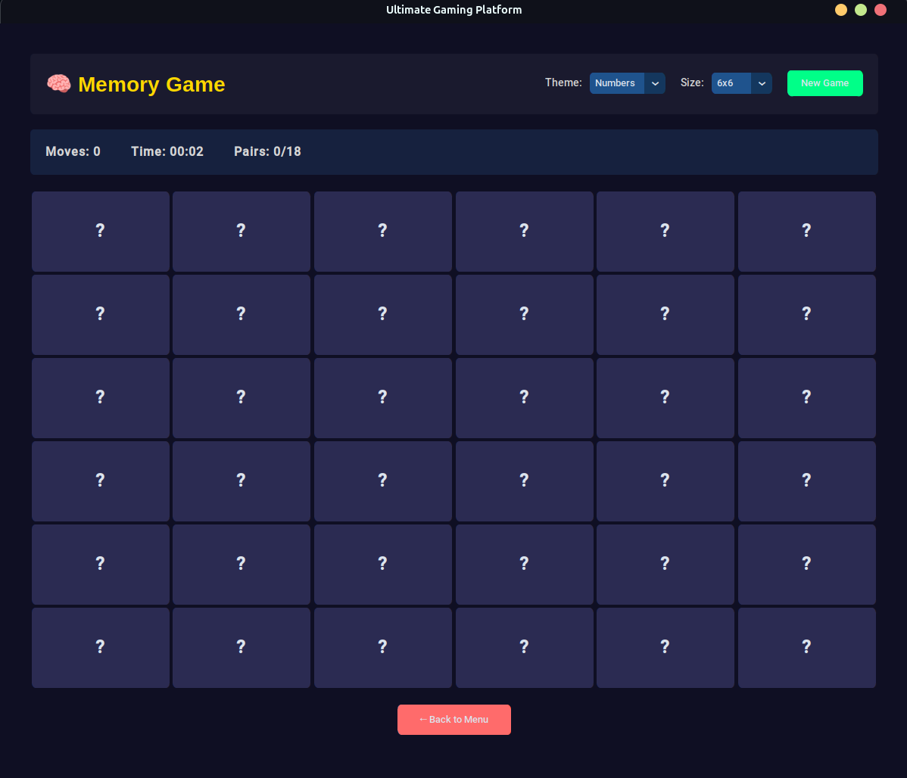

# Ultimate Gaming Platform 🎮

A comprehensive gaming platform featuring 5 engaging games with a stunning modern UI built using CustomTkinter. Transform your gaming experience with smooth animations, beautiful themes, and professional-grade user interface design.



## 🌟 Features

### 🎯 Three Complete Games
- **KBC Quiz Game** - Enhanced with lifelines, categories, and progressive difficulty
- **Snake Game** - Classic gameplay with neon-style graphics and power-ups
- **Memory Matching Game** - Card-based puzzles with 3D flip animations

### 🎨 Modern UI Design
- **Gradient Backgrounds** - Deep blues and purples with gold accents
- **Smooth Animations** - Button hover effects, scaling, and transitions
- **Responsive Design** - Consistent experience across different screen sizes
- **Professional Typography** - Carefully selected fonts and sizing

### 🚀 Advanced Features
- **High Score System** - Track your best performances across all games
- **Achievement System** - Unlock rewards for completing challenges
- **Sound Integration** - Immersive audio effects and background music
- **Statistics Dashboard** - Comprehensive gameplay analytics
- **Customizable Settings** - Adjust volume, difficulty, and themes

## 📦 Installation

### Prerequisites
- Python 3.8 or higher
- pip package manager

### Setup Instructions

1. **Clone the repository**
   ```bash
   git clone https://github.com/yourusername/ultimate-gaming-platform.git
   cd ultimate-gaming-platform
   ```

2. **Install dependencies**
   ```bash
   pip install -r requirements.txt
   ```

3. **Run the application**
   ```bash
   python App.py
   ```

### Dependencies
```
customtkinter>=5.2.0
pygame>=2.5.0
pillow>=10.0.0
playsound>=1.3.0
```

## 🗂️ Project Structure

```
UltimateGamePlatform/
├── App.py                      # Main application launcher
├── ui/
│   ├── __init__.py
│   ├── main_menu.py           # Main menu with game selection
│   └── themes.py              # UI themes and styling
├── games/
│   ├── __init__.py
│   ├── quiz_game.py           # KBC Quiz Game
│   ├── snake_game.py          # Snake Game
│   ├── memory_game.py         # Memory Matching Game
├── data/
│   ├── __init__.py
│   ├── Questions.py           # Quiz questions database
│   ├── Options.py             # Quiz answer options
│   └── CorrectAnswer.py       # Quiz correct answers
├── assets/
│   ├── images/               # Game images and icons
├── utils/
│   ├── __init__.py
│   ├── game_manager.py       # Game state management
│   └── score_manager.py      # High scores and statistics
└── requirements.txt          # Project dependencies
```

## 🎮 Games Overview

### 🧠 Quiz Game (KBC Enhanced)
- **Lifelines**: 50:50, Ask the Audience, Phone a Friend
- **Categories**: Science, History, Sports, Entertainment
- **Progressive Difficulty**: Questions get harder as you advance
- **Time Challenges**: Beat the clock for bonus points

### 🐍 Snake Game
- **Power-ups**: Speed boost, extra points, invincibility
- **Obstacles**: Dynamic barriers and maze-like levels
- **Neon Graphics**: Eye-catching visual effects
- **Multiple Modes**: Classic, Arcade, and Survival

### 🃏 Memory Game
- **Multiple Themes**: Animals, Nature, Space, Abstract
- **Grid Sizes**: 4x4 (Easy), 6x6 (Medium), 8x8 (Hard)
- **3D Animations**: Smooth card flip effects
- **Time Challenges**: Race against the clock

## 🎨 Design Philosophy

### Color Scheme
- **Primary Colors**: Deep Blue (#1a1a2e), Navy (#16213e)
- **Accent Colors**: Gold (#ffd700), Bright Yellow (#ffcc00)
- **Status Colors**: Success Green (#00ff88), Alert Red (#ff6b6b)
- **Text Colors**: Pure White (#ffffff), Light Gray (#cccccc)

### Animation Principles
- **Smooth Transitions**: 60 FPS animations for fluid experience
- **Hover Effects**: Interactive feedback on all clickable elements
- **Loading Animations**: Engaging progress indicators
- **Game Transitions**: Seamless navigation between games

## 🏆 Scoring System

- **Individual Game Scores**: Track high scores for each game
- **Global Leaderboard**: Overall platform performance
- **Achievement Points**: Unlock rewards and milestones
- **Statistics Tracking**: Games played, time spent, accuracy rates

## ⚙️ Configuration

### Settings Options
- **Audio Controls**: Master volume, sound effects, background music
- **Display Options**: Fullscreen mode, window size, theme selection
- **Gameplay Settings**: Difficulty levels, timer preferences
- **User Preferences**: Player name, avatar selection

### File Locations
- **Scores**: `data/scores.json`
- **Settings**: `data/settings.json`
- **Achievements**: `data/achievements.json`

## 🚀 Development Roadmap

### ✅ Completed Features
- [x] Project structure setup
- [x] Main menu implementation
- [x] Basic game frameworks
- [x] UI theme system

### 🔄 In Progress
- [ ] Quiz game enhancement
- [ ] Snake game development
- [ ] Memory game creation
- [ ] Sound integration

### 📋 Planned Features
- [ ] Achievement system
- [ ] Online leaderboards
- [ ] Mobile compatibility

## 🤝 Contributing

We welcome contributions! Please follow these steps:

1. **Fork the repository**
2. **Create a feature branch**: `git checkout -b feature/amazing-feature`
3. **Commit your changes**: `git commit -m 'Add amazing feature'`
4. **Push to the branch**: `git push origin feature/amazing-feature`
5. **Open a Pull Request**

### Development Guidelines
- Follow PEP 8 style guidelines
- Add comments for complex logic
- Test your changes thoroughly
- Update documentation as needed


## 🙏 Acknowledgments

- **CustomTkinter** - For the beautiful modern UI components
- **Pygame** - For game development and sound support
- **Python Community** - For excellent documentation and support
- **Game Design Inspiration** - Classic games that inspired our implementations

## 📸 Screenshots

### Main Menu


### Quiz Game


### Snake Game


### Memory Game


## 🐛 Bug Reports

Found a bug? Please create an issue with:
- **Description**: Clear description of the problem
- **Steps to Reproduce**: How to recreate the issue
- **Expected Behavior**: What should happen
- **Screenshots**: If applicable
- **System Info**: OS, Python version, etc.

## 🎯 Performance

- **Startup Time**: < 3 seconds
- **Memory Usage**: < 100MB typical
- **Frame Rate**: Consistent 60 FPS animations
- **Compatibility**: Windows 10+, macOS 10.14+, Linux Ubuntu 18+

---

⭐ **Star this repository** if you found it helpful!

**Happy Gaming!** 🎮✨
